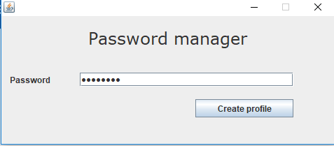
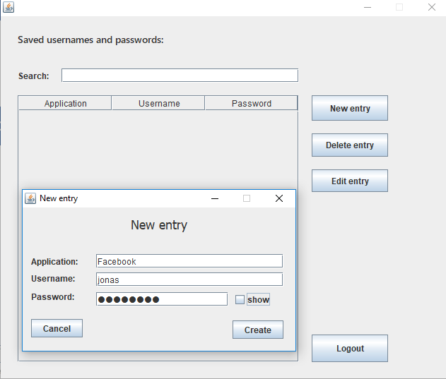
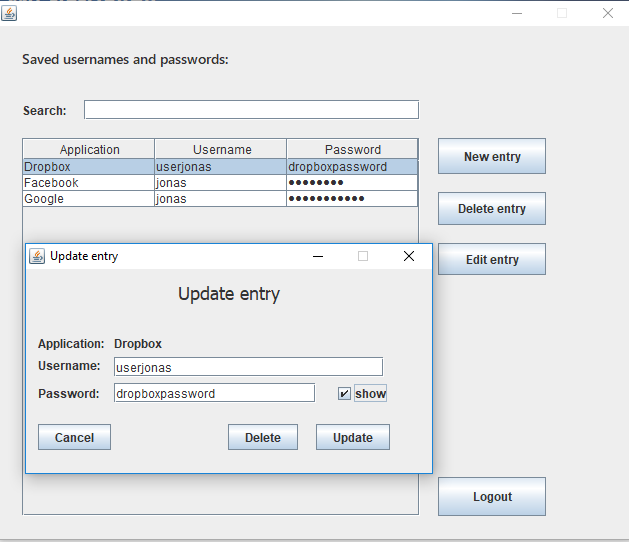

# Password Manager
Simple JAVA program that stores all of your usernames and passwords under one key.

## About
My school project finished in a couple of hours.
Unfortunately all code is in Slovene. User interface was translated to English.

## Functionality
User first creates a password that is used to encrypt entries.
User can then add, edit or delete entries (username and password).

